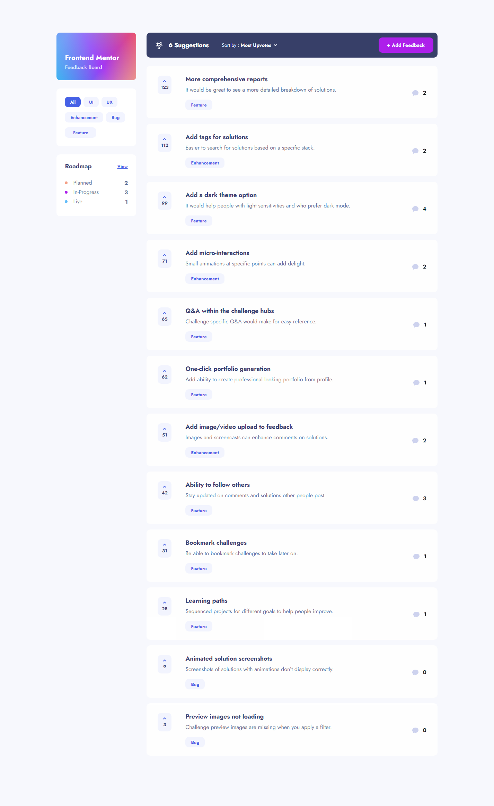

# Frontend Mentor - Product feedback app solution

This is a solution to the [Product feedback app challenge on Frontend Mentor](https://www.frontendmentor.io/challenges/product-feedback-app-wbvUYqjR6). Frontend Mentor challenges help you improve your coding skills by building realistic projects.

## Table of contents

## Overview

### The challenge

Users should be able to:

- View the optimal layout for the app depending on their device's screen size
- See hover states for all interactive elements on the page
- Create, read, update, and delete product feedback requests
- Receive form validations when trying to create/edit feedback requests
- Sort suggestions by most/least upvotes and most/least comments
- Filter suggestions by category
- Add comments and replies to a product feedback request
- Upvote product feedback requests
- **Bonus**: Keep track of any changes, even after refreshing the browser (`localStorage` could be used for this if you're not building out a full-stack app)

### Screenshot

### Links

- Solution URL: [Add solution URL here](https://your-solution-url.com)
- Live Site URL: [Add live site URL here](https://your-live-site-url.com)

## My process

### Built with

- Semantic HTML5 markup
- CSS custom properties
- Flexbox
- Mobile-first workflow
- [Vue.js](https://vuejs.org/) - JS library
- [Vuex](https://vuex.vuejs.org/) - Central Store State Management

### What I learned

One of the big things that I learned in tackling this project was the use of the Vue.JS framework.  After doing several coding project with React.JS, I decided to try my next coding challenge with a different framework for the first time and I will say...I'm liking Vue better than React.  It's Vuex state management is much easier than React Redux and it forces you to keep your code more organized without being overly strict and keeping things simple at the same time.

I also implemented new strategies with CSS styling, such as margin-left and margin-right being defined in percentages for desktop to make it better responsive to ultra wide screen monitors, so that the inner containers would not become overly stretched on those wider resolutions.

I also learned more about JSON data management, especially given that the JSON data have arrays that had arrays inside of some of its odject keys, so array methods such as for, forEach, findIndex, and splice became an important factor in adding, updating, and deleting data.

### Useful resources

- [W3Schools Javascript](https://www.w3schools.com/js/default.asp) - This helped me to reference various Javascript array methods, such as findIndex, includes, for, forEach, splice.

## Author

- Website - [Chris Paschall](https://chrisp1108.github.io/product-feedback-app/)
- Frontend Mentor - [@ChrisP1108](https://www.frontendmentor.io/profile/ChrisP1108)
- LinkedIn - [Christopher Paschall](https://www.linkedin.com/in/christopher-paschall/)

